# LTI Applicant-Tracking System (ATS) - Design Document <!-- omit in toc -->

**Version:** 1.0
**Date:** 2025-11-23
**Status:** Initial Design Phase

---

## Contents <!-- omit in toc -->

- [🧠 1. Research \& Analysis](#-1-research--analysis)
  - [a. System Description](#a-system-description)
  - [b. Client Benefits of an Applicant-Tracking System](#b-client-benefits-of-an-applicant-tracking-system)
  - [c. Key Alternatives to an ATS](#c-key-alternatives-to-an-ats)
  - [d. Most Common ATS Functionalities (Prioritized)](#d-most-common-ats-functionalities-prioritized)
  - [e. Typical Client Journey Using an ATS](#e-typical-client-journey-using-an-ats)
  - [f. Competitive Comparison of ATS Tools](#f-competitive-comparison-of-ats-tools)
- [📊 2. Business Model](#-2-business-model)
  - [Lean Canvas for LTI Applicant-Tracking System](#lean-canvas-for-lti-applicant-tracking-system)
  - [Detailed Lean Canvas Breakdown](#detailed-lean-canvas-breakdown)
  - [Business Model Validation Assumptions](#business-model-validation-assumptions)
- [🔁 3. Use Cases](#-3-use-cases)
  - [Overview of Key Use Cases](#overview-of-key-use-cases)
- [📝 Detailed Use Case Descriptions](#-detailed-use-case-descriptions)
  - [🥇 Use Case 1: Screen Candidates with AI Assistance](#-use-case-1-screen-candidates-with-ai-assistance)
  - [🥇 Use Case 2: Post a Job with Multi-Channel Distribution](#-use-case-2-post-a-job-with-multi-channel-distribution)
  - [🥈 Use Case 3: Conduct Collaborative Interview with Feedback Collection](#-use-case-3-conduct-collaborative-interview-with-feedback-collection)
- [🗃️ 4. Data Modeling](#️-4-data-modeling)
  - [Overview](#overview)
  - [🔑 Core Entities (Top 3 Most Critical)](#-core-entities-top-3-most-critical)
  - [🔗 Supporting Entities (Extended Data Model)](#-supporting-entities-extended-data-model)
  - [📊 Entity Relationship Diagram (ERD)](#-entity-relationship-diagram-erd)
  - [🔍 Key Data Model Design Decisions](#-key-data-model-design-decisions)
- [🏗️ 5. High-Level System Design](#️-5-high-level-system-design)
  - [System Architecture Overview](#system-architecture-overview)
  - [🎯 Core System Components](#-core-system-components)
  - [🔄 Data Flow Examples](#-data-flow-examples)
  - [🌐 System Architecture Diagram](#-system-architecture-diagram)
  - [🔒 Security Architecture](#-security-architecture)
  - [📈 Scalability Considerations](#-scalability-considerations)
- [🧱 6. C4 Component Diagram](#-6-c4-component-diagram)
  - [Selected Component: **AI-Powered Candidate Screening System**](#selected-component-ai-powered-candidate-screening-system)
  - [C4 Level 3: Component Diagram](#c4-level-3-component-diagram)
  - [📋 Component Descriptions](#-component-descriptions)
  - [🔄 End-to-End Screening Flow](#-end-to-end-screening-flow)
  - [🎯 Design Decisions \& Rationale](#-design-decisions--rationale)
  - [🚀 Future Enhancements](#-future-enhancements)


## 🧠 1. Research & Analysis

### a. System Description

**LTI Applicant-Tracking System (ATS)** is a comprehensive recruitment management platform designed to streamline the entire hiring lifecycle—from job posting to candidate onboarding. The system addresses the critical challenge faced by modern organizations: managing high volumes of applications efficiently while maintaining quality candidate experiences and making data-driven hiring decisions.

**Problem it solves:**
- Manual, time-consuming recruitment processes
- Poor candidate tracking and communication
- Lack of data-driven insights in hiring decisions
- Inconsistent candidate evaluation criteria
- Compliance and documentation challenges

**Competitive advantages:**
- **AI-Powered Matching:** Advanced ML algorithms for candidate-job fit scoring
- **Seamless Integration:** Native integrations with major job boards, HRIS systems, and communication tools
- **Candidate-Centric UX:** Modern, mobile-first candidate portal with real-time status updates
- **Analytics & Insights:** Comprehensive recruitment metrics and predictive hiring analytics
- **Compliance Built-In:** GDPR, EEOC, and regional compliance features embedded by design
- **Customizable Workflows:** Flexible pipeline stages adaptable to any hiring process

---

### b. Client Benefits of an Applicant-Tracking System

**Primary Value Points:**

1. **Time Efficiency**
   - Reduces time-to-hire by 40-60% through automation
   - Eliminates manual resume screening and data entry
   - Automated scheduling and communication workflows

2. **Cost Reduction**
   - Lower cost-per-hire through improved efficiency
   - Reduced reliance on external recruiters
   - Minimized bad hires through better screening

3. **Quality of Hire**
   - Data-driven candidate evaluation
   - Standardized assessment criteria
   - Better candidate-role matching through AI

4. **Improved Collaboration**
   - Centralized candidate information
   - Streamlined feedback collection from hiring teams
   - Clear role assignments and accountability

5. **Enhanced Candidate Experience**
   - Faster response times
   - Transparent application status
   - Professional, consistent communication

6. **Compliance & Risk Management**
   - Automated record-keeping for audits
   - EEOC/GDPR compliance features
   - Standardized processes reducing bias

7. **Data-Driven Decision Making**
   - Recruitment funnel analytics
   - Source effectiveness tracking
   - Predictive insights for hiring planning

**User Pain Points Solved:**

- ❌ **Lost applications** → ✅ Centralized candidate database
- ❌ **Manual resume screening** → ✅ Automated parsing and ranking
- ❌ **Email chaos** → ✅ Integrated communication hub
- ❌ **Scheduling nightmares** → ✅ Automated interview coordination
- ❌ **Lack of visibility** → ✅ Real-time pipeline dashboards
- ❌ **Compliance risks** → ✅ Built-in regulatory compliance
- ❌ **Poor candidate experience** → ✅ Modern candidate portal

---

### c. Key Alternatives to an ATS

| Alternative                         | Description                                            | When It Might Be Better                                                                 |
| ----------------------------------- | ------------------------------------------------------ | --------------------------------------------------------------------------------------- |
| **Spreadsheets (Excel/Sheets)**     | Manual tracking using shared documents                 | Very small organizations (1-5 employees) with minimal hiring needs (1-2 positions/year) |
| **Email + Calendar**                | Using existing tools without dedicated software        | Occasional hiring with no need for historical data or analytics                         |
| **HRIS with Basic Recruitment**     | HR Information Systems with light recruitment features | Organizations prioritizing unified HR data over specialized recruitment features        |
| **Recruitment Marketing Platforms** | Focus on employer branding and candidate attraction    | Early-stage startups focused on building talent pipelines rather than active hiring     |
| **LinkedIn Recruiter**              | LinkedIn's native recruiting tool                      | Heavy focus on passive candidate sourcing in professional networks                      |
| **Staffing Agency**                 | Outsourcing the entire recruitment process             | Temporary or specialized hiring needs without internal recruitment capacity             |
| **Job Board Direct Applications**   | Accepting applications directly through job boards     | Single-channel recruitment with very low volume                                         |

**When ATS is the Clear Choice:**
- Hiring more than 10 positions per year
- Multiple stakeholders in hiring decisions
- Need for compliance documentation
- Desire for process standardization
- Requirement for recruitment analytics

---

### d. Most Common ATS Functionalities (Prioritized)

#### 🥇 **Tier 1: Essential Core Features**

1. **Job Requisition Management**
   - Create, edit, and manage job postings
   - Multi-channel distribution (career site, job boards)
   - Template library for common roles
   - **Priority:** Critical - Foundation of the entire system

2. **Resume/CV Parsing & Storage**
   - Automatic extraction of candidate information
   - Searchable candidate database
   - Document management (resumes, cover letters)
   - **Priority:** Critical - Eliminates manual data entry

3. **Candidate Pipeline Management**
   - Visual pipeline/kanban boards
   - Drag-and-drop stage progression
   - Customizable workflow stages
   - **Priority:** Critical - Core workflow management

4. **Application Collection & Processing**
   - Branded career portal
   - Application forms (standard and custom)
   - Automatic acknowledgment emails
   - **Priority:** Critical - Primary candidate entry point

5. **Communication Tools**
   - Email templates and automation
   - Bulk communication capabilities
   - Communication history tracking
   - **Priority:** Critical - Maintains candidate engagement

#### 🥈 **Tier 2: Important Differentiators**

6. **Interview Management**
   - Scheduling automation (calendar integration)
   - Interview kit creation
   - Feedback collection forms
   - **Priority:** High - Major time-saver for recruiters

7. **Collaboration Features**
   - Hiring team permissions and roles
   - @mentions and internal notes
   - Rating and scorecard systems
   - **Priority:** High - Enables team-based decisions

8. **Reporting & Analytics**
   - Time-to-hire, source effectiveness
   - Pipeline conversion rates
   - Custom report builder
   - **Priority:** High - Drives process improvement

9. **Search & Filter Capabilities**
   - Boolean search
   - Advanced filters (skills, experience, location)
   - Saved searches
   - **Priority:** High - Essential for talent rediscovery

10. **Compliance Management**
    - EEOC/GDPR data collection
    - Audit trails
    - Data retention policies
    - **Priority:** High - Risk mitigation

#### 🥉 **Tier 3: Advanced/Competitive Features**

11. **AI-Powered Candidate Matching**
    - Automatic candidate ranking
    - Job-candidate fit scoring
    - Skill gap analysis
    - **Priority:** Medium - Competitive differentiator

12. **Career Site Builder**
    - Customizable employer branding
    - Mobile-responsive design
    - SEO optimization
    - **Priority:** Medium - Enhances employer brand

13. **Assessment Integration**
    - Technical skills tests
    - Personality assessments
    - Video interview tools
    - **Priority:** Medium - Improves quality of hire

14. **Employee Referral Portal**
    - Internal referral tracking
    - Referral bonus management
    - Social sharing capabilities
    - **Priority:** Medium - Low-cost sourcing channel

15. **Onboarding Workflow**
    - Offer letter generation
    - E-signature integration
    - Pre-boarding task management
    - **Priority:** Medium - Smooths transition to hire

#### 📊 **Tier 4: Nice-to-Have Features**

16. **Mobile Applications**
    - Native iOS/Android apps
    - On-the-go candidate review
    - **Priority:** Low - Convenience feature

17. **Chatbot/AI Assistant**
    - Candidate FAQs automation
    - Initial screening questions
    - **Priority:** Low - Emerging technology

18. **Social Media Integration**
    - One-click job sharing
    - Social recruitment campaigns
    - **Priority:** Low - Supplementary channel

---

### e. Typical Client Journey Using an ATS

**Context:** Mid-sized technology company (200 employees) hiring a Senior Software Engineer

#### **Phase 1: Pre-Recruitment Setup** (One-time/Periodic)
1. **System Configuration**
   - HR Admin sets up company profile and branding
   - Configures workflow stages: Applied → Phone Screen → Technical Test → Team Interview → Offer
   - Creates hiring team roles and permissions
   - Sets up email templates and automation rules

2. **Job Requisition Approval**
   - Hiring Manager creates requisition for Senior Software Engineer
   - Specifies requirements, budget, and urgency
   - Gets approval from Department Head → Finance → HR

#### **Phase 2: Job Posting & Sourcing** (Days 1-3)
3. **Job Publishing**
   - Recruiter finalizes job description using template
   - ATS automatically posts to:
     - Company career site
     - LinkedIn, Indeed, Glassdoor
     - Specialized tech job boards (Stack Overflow Jobs)
   - Generates trackable links for different channels

4. **Proactive Sourcing**
   - Recruiter searches internal candidate database
   - Uses Boolean search for passive candidates
   - Reviews past applicants who were "silver medalists"

#### **Phase 3: Application & Initial Screening** (Days 4-14)
5. **Application Intake**
   - 150 candidates apply through various channels
   - ATS automatically:
     - Parses resumes
     - Sends acknowledgment emails
     - Tags source channel
     - Screens for knockout questions (e.g., work authorization)

6. **Resume Screening**
   - AI ranks candidates by job fit score
   - Recruiter reviews top 40 candidates
   - Marks 25 for phone screening, rejects 115 with templated email
   - 10 candidates moved to "Maybe" pool

#### **Phase 4: Interview Process** (Days 15-30)
7. **Phone Screening**
   - Recruiter sends interview invitations to 25 candidates
   - Calendar integration finds mutual availability
   - Conducts 30-min screens, logs notes in ATS
   - Advances 10 candidates to technical assessment

8. **Technical Assessment**
   - Sends automated coding test via integrated platform
   - 7 candidates complete; results auto-imported to ATS
   - 5 pass threshold; recruiter schedules team interviews

9. **Team Interviews**
   - Creates interview kits (questions, scorecards)
   - Assigns interviewers: Tech Lead + 2 Engineers + Product Manager
   - Automated scheduling finds 4-hour blocks
   - Each interviewer submits scorecard in ATS
   - Team reviews candidates in centralized dashboard

#### **Phase 5: Decision & Offer** (Days 31-35)
10. **Candidate Selection**
    - Hiring committee meets (scorecards pre-reviewed in ATS)
    - Selects top candidate, identifies backup
    - HR runs background check (status tracked in ATS)

11. **Offer Management**
    - Generates offer letter from template
    - E-signature sent through ATS integration
    - Candidate accepts within 48 hours
    - ATS triggers onboarding workflow

#### **Phase 6: Post-Hire** (Days 36-60)
12. **Onboarding & Analytics**
    - Candidate moved to "Hired" stage
    - Pre-boarding tasks assigned (equipment, paperwork)
    - Unsuccessful candidates moved to talent pool for future roles
    - System generates recruitment report:
      - Time-to-hire: 35 days
      - Cost-per-hire: $4,200
      - Source: LinkedIn (chosen candidate)
      - Funnel conversion: 150 → 25 → 10 → 5 → 1

**Continuous Activities:**
- Automated email updates to candidates at each stage
- Hiring team receives notifications for pending actions
- Analytics dashboard updated in real-time
- Compliance data logged automatically

---

### f. Competitive Comparison of ATS Tools

#### **Evaluation Criteria**

We'll compare solutions across these dimensions:
- **Core ATS Features:** Job posting, candidate tracking, resume parsing
- **User Experience:** Interface quality, ease of use
- **Customization:** Workflow flexibility, branding options
- **Integration Ecosystem:** HRIS, job boards, assessment tools
- **Analytics Capability:** Reporting depth and insights
- **AI/Automation:** Smart matching, automated workflows
- **Compliance:** GDPR, EEOC, audit capabilities
- **Pricing Model:** Cost structure and scalability
- **Deployment:** Cloud, on-premise, hybrid options

---

#### **🆓 Open-Source Solutions**

##### **1. OpenCATS**
| Aspect            | Rating | Notes                                   |
| ----------------- | ------ | --------------------------------------- |
| Core ATS Features | ⭐⭐⭐    | Solid basics, limited advanced features |
| User Experience   | ⭐⭐     | Dated interface, steeper learning curve |
| Customization     | ⭐⭐⭐⭐   | Highly customizable via code            |
| Integration       | ⭐⭐     | Limited pre-built integrations          |
| Analytics         | ⭐⭐     | Basic reporting only                    |
| AI/Automation     | ⭐      | Minimal automation                      |
| Compliance        | ⭐⭐⭐    | Good data control, manual processes     |
| Pricing           | ⭐⭐⭐⭐⭐  | Free (hosting/maintenance costs)        |
| Deployment        | ⭐⭐⭐⭐⭐  | Self-hosted, full control               |

**Strengths:** Zero licensing cost, full code control, privacy-focused
**Weaknesses:** Requires technical resources, limited support, dated UX
**Best For:** Small businesses with IT capabilities, budget-constrained orgs, privacy-critical environments

---

##### **2. OrangeHRM Recruitment Module**
| Aspect            | Rating | Notes                            |
| ----------------- | ------ | -------------------------------- |
| Core ATS Features | ⭐⭐⭐⭐   | Comprehensive features           |
| User Experience   | ⭐⭐⭐    | Modern but not exceptional       |
| Customization     | ⭐⭐⭐⭐   | Good plugin architecture         |
| Integration       | ⭐⭐⭐    | HRIS-focused integrations        |
| Analytics         | ⭐⭐⭐    | Decent HR-wide reporting         |
| AI/Automation     | ⭐⭐     | Limited AI features              |
| Compliance        | ⭐⭐⭐⭐   | Strong compliance features       |
| Pricing           | ⭐⭐⭐⭐   | Free (open-source) or paid cloud |
| Deployment        | ⭐⭐⭐⭐   | Flexible deployment options      |

**Strengths:** Unified HRIS+ATS, active community, enterprise-grade features
**Weaknesses:** Recruitment is secondary to HRIS, not best-in-class ATS
**Best For:** Organizations wanting unified HR platform, growth-stage companies

---

#### **💼 Commercial Solutions**

##### **3. Greenhouse**
| Aspect            | Rating | Notes                              |
| ----------------- | ------ | ---------------------------------- |
| Core ATS Features | ⭐⭐⭐⭐⭐  | Industry-leading functionality     |
| User Experience   | ⭐⭐⭐⭐⭐  | Intuitive, modern interface        |
| Customization     | ⭐⭐⭐⭐   | Flexible workflows                 |
| Integration       | ⭐⭐⭐⭐⭐  | 450+ integrations                  |
| Analytics         | ⭐⭐⭐⭐⭐  | Advanced analytics and insights    |
| AI/Automation     | ⭐⭐⭐⭐   | Strong automation, growing AI      |
| Compliance        | ⭐⭐⭐⭐⭐  | Enterprise-grade compliance        |
| Pricing           | ⭐⭐     | Premium pricing ($6,500-25,000/yr) |
| Deployment        | ⭐⭐⭐⭐   | Cloud-only (SaaS)                  |

**Strengths:** Best-in-class UX, structured hiring approach, excellent support
**Weaknesses:** Expensive, can be complex for small teams, limited customization
**Best For:** Mid-to-large enterprises, high-volume hiring, structured processes

---

##### **4. Lever**
| Aspect            | Rating | Notes                           |
| ----------------- | ------ | ------------------------------- |
| Core ATS Features | ⭐⭐⭐⭐⭐  | Comprehensive ATS+CRM           |
| User Experience   | ⭐⭐⭐⭐⭐  | Excellent, relationship-focused |
| Customization     | ⭐⭐⭐⭐   | Good workflow customization     |
| Integration       | ⭐⭐⭐⭐   | Strong integration library      |
| Analytics         | ⭐⭐⭐⭐   | Robust analytics suite          |
| AI/Automation     | ⭐⭐⭐⭐   | AI-powered sourcing             |
| Compliance        | ⭐⭐⭐⭐   | Strong compliance tools         |
| Pricing           | ⭐⭐     | Premium ($8,000-30,000/yr)      |
| Deployment        | ⭐⭐⭐⭐   | Cloud-only (SaaS)               |

**Strengths:** CRM+ATS combined, relationship tracking, nurture campaigns
**Weaknesses:** Expensive, feature overlap can feel complex
**Best For:** Companies focused on candidate relationships, proactive sourcing strategies

---

##### **5. Workable**
| Aspect            | Rating | Notes                         |
| ----------------- | ------ | ----------------------------- |
| Core ATS Features | ⭐⭐⭐⭐   | Strong core features          |
| User Experience   | ⭐⭐⭐⭐   | Clean, easy to learn          |
| Customization     | ⭐⭐⭐    | Moderate customization        |
| Integration       | ⭐⭐⭐⭐   | Good integration options      |
| Analytics         | ⭐⭐⭐    | Standard reporting            |
| AI/Automation     | ⭐⭐⭐    | AI sourcing, basic automation |
| Compliance        | ⭐⭐⭐⭐   | Good compliance features      |
| Pricing           | ⭐⭐⭐⭐   | Mid-range ($99-299/month)     |
| Deployment        | ⭐⭐⭐⭐   | Cloud-only (SaaS)             |

**Strengths:** Balance of features and price, fast implementation, good for SMBs
**Weaknesses:** Less enterprise features, simpler analytics
**Best For:** Small-to-medium businesses, teams new to ATS, budget-conscious orgs

---

##### **6. BambooHR Hiring**
| Aspect            | Rating | Notes                             |
| ----------------- | ------ | --------------------------------- |
| Core ATS Features | ⭐⭐⭐    | Basic to intermediate             |
| User Experience   | ⭐⭐⭐⭐⭐  | Exceptional, very intuitive       |
| Customization     | ⭐⭐⭐    | Limited but sufficient            |
| Integration       | ⭐⭐⭐⭐   | Excellent with BambooHR ecosystem |
| Analytics         | ⭐⭐⭐    | Good for combined HR+recruiting   |
| AI/Automation     | ⭐⭐     | Limited AI capabilities           |
| Compliance        | ⭐⭐⭐⭐   | Strong HR compliance              |
| Pricing           | ⭐⭐⭐⭐   | Bundled with HRIS, good value     |
| Deployment        | ⭐⭐⭐⭐   | Cloud-only (SaaS)                 |

**Strengths:** Seamless HRIS integration, beautiful UX, employee-centric
**Weaknesses:** Recruitment is not primary focus, limited advanced ATS features
**Best For:** BambooHR customers, employee experience-focused companies

---

##### **7. SmartRecruiters**
| Aspect            | Rating | Notes                       |
| ----------------- | ------ | --------------------------- |
| Core ATS Features | ⭐⭐⭐⭐⭐  | Enterprise-grade features   |
| User Experience   | ⭐⭐⭐⭐   | Modern, marketplace-driven  |
| Customization     | ⭐⭐⭐⭐⭐  | Highly customizable         |
| Integration       | ⭐⭐⭐⭐⭐  | Marketplace with 600+ apps  |
| Analytics         | ⭐⭐⭐⭐   | Strong analytics            |
| AI/Automation     | ⭐⭐⭐⭐   | AI matching and automation  |
| Compliance        | ⭐⭐⭐⭐⭐  | Enterprise compliance       |
| Pricing           | ⭐⭐     | Enterprise pricing (custom) |
| Deployment        | ⭐⭐⭐⭐   | Cloud-only (SaaS)           |

**Strengths:** Marketplace ecosystem, global capabilities, enterprise scalability
**Weaknesses:** Complex for small teams, requires configuration
**Best For:** Large enterprises, global organizations, complex hiring needs

---

#### **📊 Comparative Summary Matrix**

| Solution            | Type            | Best For             | Price Range | Key Strength          |
| ------------------- | --------------- | -------------------- | ----------- | --------------------- |
| **OpenCATS**        | Open-Source     | Budget/Privacy       | Free*       | Full control          |
| **OrangeHRM**       | Open/Commercial | Unified HR           | Free-$$     | HRIS+ATS combo        |
| **Greenhouse**      | Commercial      | Enterprise           | $$$$        | Structured hiring     |
| **Lever**           | Commercial      | Relationship-focused | $$$$        | ATS+CRM combined      |
| **Workable**        | Commercial      | SMB                  | $$          | Balance & value       |
| **BambooHR**        | Commercial      | Employee experience  | $$$         | UX excellence         |
| **SmartRecruiters** | Commercial      | Global enterprise    | $$$$        | Marketplace ecosystem |

**Price Guide:** Free* = hosting costs only, $ = $0-3K/yr, $$ = $3-10K/yr, $$$ = $10-25K/yr, $$$$ = $25K+/yr

---

#### **🎯 LTI ATS Positioning**

Based on this competitive analysis, **LTI ATS should differentiate by:**

1. **AI-First Approach:** More advanced ML than competitors in candidate matching
2. **Mid-Market Sweet Spot:** Enterprise features at SMB pricing ($5-15K/yr)
3. **Developer-Friendly:** API-first architecture, extensive customization
4. **Modern Tech Stack:** Best-in-class performance and mobile experience
5. **Privacy & Compliance:** European-style data protection as standard
6. **Vertical Specialization:** Initially focus on tech hiring (later expand)

**Target Positioning:** "Enterprise-grade ATS for growth companies — AI-powered, developer-friendly, and privacy-first."

---

## 📊 2. Business Model

### Lean Canvas for LTI Applicant-Tracking System

```mermaid
graph TB
    subgraph LeanCanvas["LTI ATS - Lean Canvas"]
        Problem["<b>1. PROBLEM</b><br/>━━━━━━━━━━━━━━━━<br/>Top 3 Problems:<br/><br/>• Manual screening wastes<br/>  recruiter time (60% of day)<br/><br/>• Poor candidate experience<br/>  damages employer brand<br/><br/>• No hiring insights leads to<br/>  repeated mistakes<br/><br/>Existing Alternatives:<br/>• Spreadsheets<br/>• Enterprise ATS (too expensive)<br/>• Email chaos"]

        Solution["<b>2. SOLUTION</b><br/>━━━━━━━━━━━━━━━━<br/>Top 3 Features:<br/><br/>• AI-powered candidate<br/>  matching & ranking<br/><br/>• Automated candidate<br/>  communication hub<br/><br/>• Real-time analytics<br/>  dashboard<br/><br/>High-Level Concept:<br/>Greenhouse simplicity +<br/>LinkedIn AI + Stripe UX"]

        UVP["<b>3. UNIQUE VALUE<br/>PROPOSITION</b><br/>━━━━━━━━━━━━━━━━<br/><br/>Enterprise-grade hiring<br/>intelligence at SMB pricing<br/><br/>━━━━━━━━━━━━━━━━<br/><br/>High-Level Concept:<br/>'Greenhouse meets<br/>HubSpot for recruiting'<br/><br/>━━━━━━━━━━━━━━━━<br/>X Factor:<br/>AI does the screening,<br/>you make the call"]

        Advantage["<b>4. UNFAIR ADVANTAGE</b><br/>━━━━━━━━━━━━━━━━<br/><br/>• Proprietary ML models trained<br/>  on 10M+ successful hires<br/><br/>• Founding team from Google<br/>  Hire + Workday background<br/><br/>• Exclusive partnerships with<br/>  dev assessment platforms<br/><br/>• First-mover in privacy-first<br/>  ATS positioning"]

        Segments["<b>5. CUSTOMER SEGMENTS</b><br/>━━━━━━━━━━━━━━━━<br/><br/>Early Adopters:<br/>• Tech startups (50-200 emp)<br/>• High-growth SaaS companies<br/>• VC-backed Series A-C<br/><br/>Target Characteristics:<br/>• Hiring 20-100/year<br/>• Outgrown spreadsheets<br/>• Can't afford Greenhouse<br/>• Value modern UX"]

        Channels["<b>6. CHANNELS</b><br/>━━━━━━━━━━━━━━━━<br/><br/>Path to Customers:<br/><br/>• Product-led growth<br/>  (freemium model)<br/><br/>• HR Tech communities<br/>  (People Ops forums)<br/><br/>• Content marketing<br/>  (hiring best practices)<br/><br/>• Partner with HRIS<br/>  (BambooHR, Rippling)"]

        Revenue["<b>7. REVENUE STREAMS</b><br/>━━━━━━━━━━━━━━━━<br/><br/>• SaaS Subscription<br/>  $199/mo (starter)<br/>  $499/mo (growth)<br/>  $999/mo (enterprise)<br/><br/>• Per-hire success fee<br/>  ($150-300/hire alternative)<br/><br/>• Premium AI features<br/>  ($99/mo add-on)<br/><br/>Lifetime Value: $18K"]

        Costs["<b>8. COST STRUCTURE</b><br/>━━━━━━━━━━━━━━━━<br/><br/>Fixed Costs:<br/>• Engineering team (60%)<br/>• Cloud infrastructure (10%)<br/><br/>Variable Costs:<br/>• Sales & marketing (20%)<br/>• Customer support (10%)<br/>• AI/ML compute costs<br/>  (scales with usage)"]

        Metrics["<b>9. KEY METRICS</b><br/>━━━━━━━━━━━━━━━━<br/><br/>• Monthly Recurring Revenue<br/>  (MRR)<br/><br/>• Customer Acquisition Cost<br/>  (CAC: target <$2K)<br/><br/>• Net Revenue Retention<br/>  (target 120%+)<br/><br/>• Time-to-value<br/>  (first hire in <14 days)"]
    end

    Problem -.-> Solution
    Solution -.-> UVP
    UVP -.-> Advantage
    Segments -.-> Channels
    Channels -.-> Revenue
    Revenue -.-> Costs
    Costs -.-> Metrics
```



### Detailed Lean Canvas Breakdown

#### 📦 **Box 1: Problem**

**Top 3 Problems (ranked by severity):**

1. **Manual Resume Screening Time Sink** (Critical Pain)
   - Recruiters spend 60% of their day reading resumes
   - Average 250 applicants per role, only 5-10 qualified
   - Leads to recruiter burnout and slow hiring

2. **Poor Candidate Experience Damages Brand** (High Pain)
   - 60% of candidates never hear back after applying
   - Inconsistent communication erodes employer brand
   - Lost quality candidates to competitors with better UX

3. **No Data = Repeated Hiring Mistakes** (Medium Pain)
   - Can't identify best sourcing channels
   - No visibility into pipeline bottlenecks
   - Repeat bad hiring patterns

**Existing Alternatives:**
- Spreadsheets (manual, error-prone)
- Enterprise ATS (Greenhouse: too expensive at $25K/yr)
- Email + Calendar (chaos at scale)

---

#### ✅ **Box 2: Solution**

**Top 3 Features:**

1. **AI Candidate Matching Engine**
   - Automatic resume parsing and ranking
   - Job-candidate fit scoring (0-100)
   - Reduces screening time by 80%

2. **Automated Communication Hub**
   - Trigger-based emails at every stage
   - Bulk updates with personalization
   - Candidate self-service portal

3. **Real-Time Analytics Dashboard**
   - Source effectiveness tracking
   - Pipeline conversion metrics
   - Predictive time-to-hire

**High-Level Concept:**
*"Greenhouse's simplicity + LinkedIn's AI + Stripe's user experience"*

---

#### 🎯 **Box 3: Unique Value Proposition**

**Single Clear Message:**
*"Enterprise-grade hiring intelligence at SMB pricing"*

**Elaboration:**
Companies with 50-200 employees deserve the same AI-powered tools that Google and Facebook use internally, without the $50K+ price tag.

**X-Factor:**
*"The AI does the screening, you make the decision"* — augmenting recruiters, not replacing them.

---

#### 🛡️ **Box 4: Unfair Advantage**

(Note: Must be something competitors can't easily copy)

1. **Proprietary ML Models**
   - Trained on 10M+ anonymized successful hire patterns
   - Continuously learning from customer hiring outcomes
   - 3+ years of model refinement head start

2. **Founding Team Pedigree**
   - Ex-Google Hire, Workday, and Lever engineering leads
   - Deep domain expertise in recruitment tech

3. **Strategic Partnerships**
   - Exclusive integrations with developer assessment platforms (HackerRank, CodeSignal)
   - Co-marketing with HRIS providers

4. **Privacy-First Positioning**
   - First ATS built GDPR-native from day one
   - Becomes mandatory moat as regulations tighten

---

#### 👥 **Box 5: Customer Segments**

**Primary Segment: High-Growth Tech Companies (50-200 employees)**

**Characteristics:**
- Series A to Series C funding stage
- Hiring 20-100 employees per year
- Distributed/remote teams
- Technical hiring focus (engineering, product, design)

**Early Adopter Profile:**
- VP of People or Head of Talent
- Previously used spreadsheets or basic tools
- Budget: $10-20K/yr for recruitment tech
- Values: Modern UX, data-driven decisions, speed

**Why This Segment:**
- High pain (rapid hiring needs)
- Budget exists but constrained (can't afford Greenhouse)
- Tech-forward (willing to adopt new tools)
- Viral potential (share in founder networks)

---

#### 📢 **Box 6: Channels**

**Acquisition Channels (prioritized):**

1. **Product-Led Growth (Primary)**
   - Freemium tier: 1 job, 50 candidates/month free
   - Self-serve signup, viral invite loops
   - In-app upgrade prompts

2. **Content Marketing**
   - "State of Tech Hiring" annual report
   - Hiring playbooks for hypergrowth startups
   - SEO for "ATS for startups" keywords

3. **Community Engagement**
   - Active in People Ops Slack communities
   - Sponsor HR tech conferences (Talent42, ERE)
   - Partnerships with startup accelerators (Y Combinator, Techstars)

4. **Integration Partnerships**
   - BambooHR, Rippling, Gusto app marketplaces
   - Co-selling motions with HRIS providers
   - Referral fees for mutual customers

---

#### 💰 **Box 7: Revenue Streams**

**Primary: SaaS Subscription (Tiered Pricing)**

| Tier           | Price/Month | Target Customer  | Key Features                              |
| -------------- | ----------- | ---------------- | ----------------------------------------- |
| **Starter**    | $199        | 1-50 employees   | 5 active jobs, basic ATS                  |
| **Growth**     | $499        | 50-200 employees | Unlimited jobs, AI matching, integrations |
| **Enterprise** | $999+       | 200+ employees   | Custom workflows, SSO, dedicated support  |

**Secondary: Usage-Based Pricing Option**
- $0/month base + $150-300 per hire
- Appeals to seasonal/sporadic hirers
- Converts to subscription at volume

**Add-Ons:**
- Premium AI features: $99/month
- Advanced analytics pack: $199/month
- Additional user seats: $49/user/month

**Economics:**
- Average Customer LTV: $18,000 (3-year retention)
- Target CAC: <$2,000 (9-month payback)

---

#### 💸 **Box 8: Cost Structure**

**Fixed Costs (Majority of Spend):**

- **Engineering & Product (60%)**
  - 10-person engineering team
  - ML/AI specialists
  - Product designers

- **Cloud Infrastructure (10%)**
  - AWS hosting
  - Database costs
  - ML model serving

**Variable Costs:**

- **Sales & Marketing (20%)**
  - Content creation
  - Paid acquisition
  - Sales team (as we grow)

- **Customer Success (10%)**
  - Support team
  - Onboarding specialists
  - Customer training

**Unit Economics:**
- Gross margin target: 80%+
- Variable cost per customer: ~$200/year (hosting, support)

---

#### 📈 **Box 9: Key Metrics**

**North Star Metric:**
**Net Revenue Retention (NRR)** — Target: 120%+
(Measures expansion revenue from existing customers)

**Supporting Metrics:**

1. **Monthly Recurring Revenue (MRR)**
   - Target: $100K MRR by end of Year 1
   - Growth rate: 15-20% month-over-month

2. **Customer Acquisition Cost (CAC)**
   - Target: <$2,000
   - Channel: $500 (product-led), $3,000 (sales-led)

3. **Time-to-Value**
   - First candidate added: <24 hours
   - First hire made using LTI: <14 days
   - Measures onboarding effectiveness

4. **Product Engagement**
   - Daily Active Users (DAU) per account
   - Feature adoption rate (% using AI matching)
   - NPS score: Target 50+

5. **Pipeline Efficiency**
   - Lead → Trial conversion: 30%
   - Trial → Paid conversion: 25%
   - Overall funnel: 7.5% lead-to-customer

---

### Business Model Validation Assumptions

**Critical Assumptions to Test:**

1. ✅ **Willingness to Pay:** Will companies pay $499/mo for ATS?
   - **Test:** Pre-sales with 20 target customers

2. ✅ **AI Value Perception:** Do recruiters trust AI candidate rankings?
   - **Test:** A/B test: AI-ranked vs. manual, measure time savings

3. ✅ **Self-Serve Adoption:** Can customers onboard without human help?
   - **Test:** Freemium signup flow, track completion rates

4. ✅ **Retention Driver:** Does AI accuracy drive retention?
   - **Test:** Cohort analysis of AI-heavy vs. light users

---

## 🔁 3. Use Cases

### Overview of Key Use Cases

The LTI ATS supports the complete recruitment lifecycle. Below are the **most important use cases** ranked by frequency and business impact:

| Priority | Use Case                            | Description                                            | Primary Actor              | Frequency        |
| -------- | ----------------------------------- | ------------------------------------------------------ | -------------------------- | ---------------- |
| 🥇 **1**  | **Post a Job**                      | Create and distribute job listing to multiple channels | Recruiter                  | High (weekly)    |
| 🥇 **2**  | **Screen Candidates**               | Review, rank, and filter applicants                    | Recruiter                  | Critical (daily) |
| 🥇 **3**  | **Move Candidate Through Pipeline** | Progress candidates through hiring stages              | Recruiter/Hiring Manager   | Critical (daily) |
| 🥈 **4**  | **Schedule Interview**              | Coordinate interviews with candidates and team         | Recruiter/Coordinator      | High (daily)     |
| 🥈 **5**  | **Collect Interview Feedback**      | Gather structured feedback from interviewers           | Hiring Manager/Interviewer | High (daily)     |
| 🥈 **6**  | **Communicate with Candidates**     | Send updates, requests, and status changes             | Recruiter                  | High (daily)     |
| 🥉 **7**  | **Search Talent Pool**              | Find past candidates for new roles                     | Recruiter                  | Medium (weekly)  |
| 🥉 **8**  | **Generate Hiring Reports**         | Analyze recruitment metrics and trends                 | HR Manager/Executive       | Medium (monthly) |
| 🥉 **9**  | **Extend Job Offer**                | Create and send formal offer letters                   | Recruiter/HR               | Medium (weekly)  |
| 🥉 **10** | **Manage Employee Referrals**       | Track and incentivize internal referrals               | Recruiter/Employee         | Medium (ongoing) |

---

## 📝 Detailed Use Case Descriptions

### 🥇 Use Case 1: Screen Candidates with AI Assistance

**Primary Actor:** Recruiter
**Goal:** Identify the most qualified candidates from a large applicant pool efficiently
**Trigger:** New applications received for a job posting
**Frequency:** Daily (Critical path)

#### **Textual Flow Description**

**Preconditions:**
- Job posting is active and receiving applications
- AI matching model is trained for the role
- Candidate data has been parsed and stored

**Main Success Scenario:**

1. **System automatically processes new applications**
   - Resume parsing extracts candidate data (skills, experience, education)
   - AI matching engine calculates fit score (0-100) based on job requirements
   - Candidates are ranked in the pipeline view

2. **Recruiter reviews AI-generated insights**
   - Opens the "Applied" stage for the Software Engineer role
   - Sees 47 new candidates, sorted by AI match score
   - Reviews top candidate's profile with highlighted matching criteria:
     - ✅ 5 years Python experience (required: 3+)
     - ✅ Django framework expertise
     - ✅ Remote work experience
     - ⚠️ No AWS experience (nice-to-have)

3. **Recruiter applies filters and search**
   - Adds filter: "Must have AWS certification"
   - Narrows to 12 candidates
   - Clicks on candidate #3 to review full profile

4. **Recruiter makes screening decision**
   - Option A: Advance to "Phone Screen" stage (bulk action for top 10)
   - Option B: Reject with templated email
   - Option C: Add to "Maybe" list for future review
   - Option D: Request additional information

5. **System executes action**
   - Sends automated email to advanced candidates
   - Updates candidate status
   - Logs decision and rationale
   - Updates analytics dashboard

**Postconditions:**
- Qualified candidates moved to next stage
- Rejected candidates notified
- Audit trail created for compliance
- Time-to-screen reduced by 75%

**Alternative Flows:**

- **A1:** AI score is low for all candidates
  - System suggests adjusting job requirements
  - Recommends re-posting to different channels

- **A2:** Recruiter disagrees with AI ranking
  - Manually overrides score with justification
  - System learns from feedback for future roles

**Business Rules:**
- Candidates cannot be rejected without selecting a reason (EEOC compliance)
- All screening decisions logged for audit purposes
- Minimum 2 business days before auto-rejection emails sent

---

#### **Use Case 1 Diagram: Screen Candidates**


---

### 🥇 Use Case 2: Post a Job with Multi-Channel Distribution

**Primary Actor:** Recruiter
**Goal:** Create a job posting and distribute it to multiple channels to attract qualified candidates
**Trigger:** Hiring manager approves job requisition
**Frequency:** Weekly (High priority)

#### **Textual Flow Description**

**Preconditions:**
- Recruiter has approval for headcount
- Job requisition details are available (title, requirements, budget)
- Integration with job boards is configured

**Main Success Scenario:**

1. **Recruiter initiates job creation**
   - Navigates to "Jobs" → "Create New Job"
   - Selects job template: "Senior Software Engineer" (pre-filled)
   - Or starts from blank template

2. **Recruiter fills out job details**
   - **Basic Info:** Title, Department, Location (Remote/Hybrid/Onsite)
   - **Job Description:** Responsibilities, qualifications (WYSIWYG editor)
   - **Requirements:** Must-have vs. nice-to-have skills
   - **Workflow:** Selects pipeline stages (Applied → Phone → Technical → Onsite → Offer)
   - **Team:** Assigns hiring manager and interview panel
   - **Settings:** Salary range (optional), EEO questions, knockout questions

3. **Recruiter configures distribution channels**
   - **Career Site:** Auto-publishes (default)
   - **Job Boards:** Selects LinkedIn, Indeed, Glassdoor
   - **Social Media:** Generates shareable link for Twitter/Facebook
   - **Employee Referral:** Enables internal referral bonus ($2,000)

4. **System validates and previews**
   - Checks for required fields
   - Previews how job appears on career site and LinkedIn
   - Estimates reach: "Expected 200-400 applicants in 30 days"

5. **Recruiter publishes job**
   - Clicks "Publish"
   - System distributes to all selected channels
   - Generates unique tracking URLs for each source

6. **System confirms and monitors**
   - Sends confirmation email to recruiter
   - Dashboard shows job status: "Active - 0 applicants"
   - Tracks views and applications by source

**Postconditions:**
- Job is live on all selected platforms
- Tracking links are active
- Application pipeline is ready to receive candidates
- Hiring team is notified

**Alternative Flows:**

- **A1:** Job requires approval before publishing
  - Submitted to hiring manager → approved → auto-publishes

- **A2:** Job board integration fails
  - System alerts recruiter
  - Provides manual posting instructions

- **A3:** Recruiter wants to schedule publish for future date
  - Sets publish date/time
  - System auto-publishes at scheduled time

**Business Rules:**
- Jobs must include EEO compliance questions for US roles
- Salary ranges required for CO/CA/NY locations
- Cannot publish job without assigned hiring manager

---

#### **Use Case 2 Diagram: Post a Job**


---

### 🥈 Use Case 3: Conduct Collaborative Interview with Feedback Collection

**Primary Actor:** Hiring Manager, Interviewers
**Supporting Actor:** Recruiter (coordinator)
**Goal:** Conduct structured interviews and collect standardized feedback to make data-driven hiring decisions
**Trigger:** Candidate advances to interview stage
**Frequency:** Daily (High priority)

#### **Textual Flow Description**

**Preconditions:**
- Candidate has passed initial screening
- Interview panel is assigned
- Interview schedule is confirmed
- Interview kit (questions, scorecard) is prepared

**Main Success Scenario:**

1. **Recruiter prepares interview kit**
   - Creates interview kit for "Senior Software Engineer - Sarah Chen"
   - Adds structured questions:
     - Technical Lead: System design questions
     - Engineer 1: Coding challenge (live)
     - Engineer 2: Behavioral questions
     - Product Manager: Product thinking scenarios
   - Attaches candidate resume and AI match report
   - Sets evaluation criteria scorecard (1-5 scale):
     - Technical Skills
     - Communication
     - Culture Fit
     - Problem Solving

2. **System schedules and notifies**
   - Sends calendar invites to all participants
   - Each interviewer receives:
     - Interview kit with their assigned questions
     - Candidate profile and background
     - Zoom/meet link (if virtual)
     - Scorecard link

3. **Interviewers conduct interviews**
   - Technical Lead conducts 60-min system design interview
   - Takes notes during session
   - Immediately after interview, opens LTI ATS mobile app

4. **Interviewer submits feedback**
   - Rates candidate on scorecard (1-5 for each criterion)
   - Adds written feedback:
     - **Strengths:** "Excellent grasp of microservices architecture. Proposed a scalable solution with proper tradeoff analysis."
     - **Concerns:** "Hesitated on database sharding strategies. May need mentorship on distributed systems."
     - **Recommendation:** "Strong Yes - Advance to next round"
   - Submits feedback (deadline: 24 hours)

5. **System aggregates feedback**
   - Hiring Manager sees dashboard:
     - 4/4 interviewers submitted feedback
     - Average score: 4.2/5.0
     - Recommendations: 3 "Strong Yes", 1 "Yes"
   - AI summary highlights:
     - ✅ Consensus strength: Technical architecture
     - ⚠️ Noted gap: Distributed systems experience

6. **Hiring Manager makes decision**
   - Reviews aggregated feedback
   - Options:
     - **A:** Advance to "Offer" stage
     - **B:** Request additional interview (e.g., distributed systems deep-dive)
     - **C:** Reject with feedback
     - **D:** Put on hold
   - Selects: Advance to Offer
   - System notifies recruiter to prepare offer

**Postconditions:**
- All interview feedback is documented
- Candidate decision is recorded with justification
- Next steps are triggered (offer prep or rejection email)
- Analytics updated (interview-to-offer conversion rate)

**Alternative Flows:**

- **A1:** Interviewer misses feedback deadline
  - System sends reminder at 12 hours
  - Escalates to hiring manager at 24 hours
  - Hiring manager can proceed with partial feedback (logged as exception)

- **A2:** Conflicting feedback (2 "Strong Yes", 2 "No")
  - System flags for hiring manager review
  - Suggests debrief meeting
  - Hiring manager schedules consensus call

- **A3:** Candidate declines offer after positive interviews
  - Feedback is saved to candidate profile
  - If re-applies in future, past interviews are visible
  - Recruiter can fast-track based on historical data

**Business Rules:**
- All interviewers must submit feedback before final decision
- Feedback is confidential (not shared with candidate)
- Scorecards must include written justification for scores <3 or >4
- Interview feedback stored for 2 years (compliance requirement)

---

#### **Use Case 3 Diagram: Collaborative Interview Process**


---

## 🗃️ 4. Data Modeling

### Overview

The LTI ATS data model is designed around the core recruitment workflow, with entities representing jobs, candidates, and their interactions throughout the hiring pipeline. The model balances normalization for data integrity with denormalization for query performance, particularly for high-frequency operations like candidate searches and pipeline views.

**Design Principles:**
- **Event-sourced feedback:** Interview feedback and stage transitions are immutable events
- **Flexible metadata:** JSON fields for custom attributes (org-specific workflows)
- **Audit trail:** Comprehensive tracking for compliance (EEOC, GDPR)
- **Performance-optimized:** Indexed fields for common queries (candidate search, pipeline filtering)

---

### 🔑 Core Entities (Top 3 Most Critical)

---

#### **1. Entity: `Candidate`**

**Description:**
Represents an individual who has applied for one or more jobs. The central entity around which the entire ATS revolves. Stores both structured data (parsed from resume) and unstructured data (original documents).

**Essential Fields:**

| Field Name           | Type          | Description                                                                                                  | Constraints               |
| -------------------- | ------------- | ------------------------------------------------------------------------------------------------------------ | ------------------------- |
| `id`                 | UUID          | Primary key                                                                                                  | PK, Not Null              |
| `email`              | String (255)  | Primary contact email                                                                                        | Unique, Not Null, Indexed |
| `first_name`         | String (100)  | First name                                                                                                   | Not Null                  |
| `last_name`          | String (100)  | Last name                                                                                                    | Not Null                  |
| `phone`              | String (20)   | Phone number                                                                                                 | Nullable                  |
| `location`           | String (255)  | City, State/Country                                                                                          | Nullable                  |
| `linkedin_url`       | String (500)  | LinkedIn profile URL                                                                                         | Nullable                  |
| `github_url`         | String (500)  | GitHub profile URL                                                                                           | Nullable                  |
| `portfolio_url`      | String (500)  | Personal website/portfolio                                                                                   | Nullable                  |
| `resume_url`         | String (500)  | S3/cloud storage URL for resume PDF                                                                          | Nullable                  |
| `parsed_resume_data` | JSON          | Structured data from AI parsing:<br/>• skills: [String]<br/>• experience: [Object]<br/>• education: [Object] | Nullable                  |
| `source`             | Enum          | How candidate found job:<br/>`linkedin`, `indeed`, `referral`, `direct`, `agency`                            | Indexed                   |
| `tags`               | Array[String] | Custom tags (e.g., "relocation-ready", "senior-level")                                                       | Nullable                  |
| `gdpr_consent`       | Boolean       | GDPR consent for data storage                                                                                | Default: False            |
| `gdpr_consent_date`  | Timestamp     | When consent was granted                                                                                     | Nullable                  |
| `created_at`         | Timestamp     | When candidate first applied                                                                                 | Not Null, Indexed         |
| `updated_at`         | Timestamp     | Last modification                                                                                            | Not Null                  |

**Relationships:**
- **One-to-Many** with `Application`: A candidate can apply to multiple jobs
- **One-to-Many** with `Interview`: A candidate can have multiple interview records
- **Many-to-Many** with `Tag` (through junction table): Custom tagging
- **One-to-Many** with `Note`: Internal recruiter notes on candidate

**Key Indexes:**
- `email` (unique lookup)
- `created_at` (recent candidates)
- `source` (source effectiveness analytics)
- Full-text search on `parsed_resume_data.skills`

---

#### **2. Entity: `Job`**

**Description:**
Represents an open position (job requisition). Contains job description, requirements, workflow configuration, and distribution settings. The anchor for all candidate applications and hiring pipelines.

**Essential Fields:**

| Field Name           | Type          | Description                                                                                                                   | Constraints       |
| -------------------- | ------------- | ----------------------------------------------------------------------------------------------------------------------------- | ----------------- |
| `id`                 | UUID          | Primary key                                                                                                                   | PK, Not Null      |
| `title`              | String (255)  | Job title (e.g., "Senior Software Engineer")                                                                                  | Not Null, Indexed |
| `department`         | String (100)  | Department/team (e.g., "Engineering")                                                                                         | Not Null          |
| `employment_type`    | Enum          | `full_time`, `part_time`, `contract`, `intern`                                                                                | Not Null          |
| `location_type`      | Enum          | `remote`, `onsite`, `hybrid`                                                                                                  | Not Null          |
| `location`           | String (255)  | Office location (if not fully remote)                                                                                         | Nullable          |
| `description`        | Text          | Full job description (rich text/markdown)                                                                                     | Not Null          |
| `requirements`       | JSON          | Structured requirements:<br/>• must_have_skills: [String]<br/>• nice_to_have_skills: [String]<br/>• years_experience: Integer | Not Null          |
| `salary_min`         | Integer       | Minimum salary (in cents)                                                                                                     | Nullable          |
| `salary_max`         | Integer       | Maximum salary (in cents)                                                                                                     | Nullable          |
| `salary_currency`    | String (3)    | ISO currency code (e.g., "USD")                                                                                               | Default: "USD"    |
| `hiring_manager_id`  | UUID          | FK to User (hiring manager)                                                                                                   | Not Null, FK      |
| `recruiter_id`       | UUID          | FK to User (assigned recruiter)                                                                                               | Not Null, FK      |
| `status`             | Enum          | `draft`, `active`, `paused`, `closed`, `cancelled`                                                                            | Not Null, Indexed |
| `workflow_stages`    | JSON          | Ordered array of pipeline stages:<br/>[{"name": "Applied", "order": 1}, ...]                                                  | Not Null          |
| `published_channels` | Array[String] | Where job is posted:<br/>`career_site`, `linkedin`, `indeed`                                                                  | Nullable          |
| `published_at`       | Timestamp     | When job went live                                                                                                            | Nullable          |
| `closed_at`          | Timestamp     | When job was filled/closed                                                                                                    | Nullable          |
| `eeo_required`       | Boolean       | Whether EEO questions are mandatory                                                                                           | Default: True     |
| `created_at`         | Timestamp     | Job creation date                                                                                                             | Not Null          |
| `updated_at`         | Timestamp     | Last modification                                                                                                             | Not Null          |

**Relationships:**
- **Many-to-One** with `User` (hiring_manager_id): Job owner
- **Many-to-One** with `User` (recruiter_id): Assigned recruiter
- **One-to-Many** with `Application`: All applications for this job
- **Many-to-Many** with `User` (through `JobInterviewer`): Interview panel

**Key Indexes:**
- `status` (active jobs query)
- `hiring_manager_id` (manager's jobs)
- `created_at` (recent jobs)

---

#### **3. Entity: `Application`**

**Description:**
Represents a candidate's application to a specific job. Tracks the candidate's journey through the hiring pipeline, including current stage, AI match score, and stage history. This is the primary entity for recruiter workflows.

**Essential Fields:**

| Field Name                | Type         | Description                                                            | Constraints           |
| ------------------------- | ------------ | ---------------------------------------------------------------------- | --------------------- |
| `id`                      | UUID         | Primary key                                                            | PK, Not Null          |
| `candidate_id`            | UUID         | FK to Candidate                                                        | Not Null, FK, Indexed |
| `job_id`                  | UUID         | FK to Job                                                              | Not Null, FK, Indexed |
| `current_stage`           | String (100) | Current pipeline stage (e.g., "Phone Screen")                          | Not Null, Indexed     |
| `stage_order`             | Integer      | Numeric order for sorting (1, 2, 3...)                                 | Not Null              |
| `ai_match_score`          | Integer      | AI-calculated fit score (0-100)                                        | Nullable, Indexed     |
| `ai_match_reasons`        | JSON         | Why AI scored this way:<br/>• strengths: [String]<br/>• gaps: [String] | Nullable              |
| `source`                  | Enum         | Application source: `direct`, `linkedin`, `referral`, `indeed`         | Not Null, Indexed     |
| `referrer_id`             | UUID         | FK to User (if employee referral)                                      | Nullable, FK          |
| `status`                  | Enum         | `active`, `hired`, `rejected`, `withdrawn`                             | Not Null, Indexed     |
| `rejection_reason`        | String (500) | Why candidate was rejected (for analytics)                             | Nullable              |
| `applied_at`              | Timestamp    | When candidate applied                                                 | Not Null, Indexed     |
| `last_stage_change_at`    | Timestamp    | When stage was last updated                                            | Not Null              |
| `hired_at`                | Timestamp    | When candidate was hired (if applicable)                               | Nullable              |
| `rejected_at`             | Timestamp    | When candidate was rejected (if applicable)                            | Nullable              |
| `cover_letter`            | Text         | Candidate's cover letter                                               | Nullable              |
| `questionnaire_responses` | JSON         | Answers to custom application questions                                | Nullable              |

**Relationships:**
- **Many-to-One** with `Candidate`: Who applied
- **Many-to-One** with `Job`: Which job they applied to
- **Many-to-One** with `User` (referrer_id): Who referred them
- **One-to-Many** with `StageTransition`: History of stage changes
- **One-to-Many** with `Interview`: All interviews for this application
- **One-to-Many** with `Note`: Recruiter notes on this application

**Key Indexes:**
- Composite: `(job_id, current_stage)` (pipeline view query)
- `ai_match_score` (sorting by match quality)
- `applied_at` (recent applications)
- `status` (active vs. closed applications)

**Unique Constraint:**
- `(candidate_id, job_id)`: A candidate can only apply once per job

---

### 🔗 Supporting Entities (Extended Data Model)

---

#### **4. Entity: `User`**

**Description:**
Represents internal users of the ATS (recruiters, hiring managers, interviewers, admins). Handles authentication, permissions, and role-based access control.

**Essential Fields:**

| Field Name      | Type         | Description                                                          |
| --------------- | ------------ | -------------------------------------------------------------------- |
| `id`            | UUID         | Primary key                                                          |
| `email`         | String (255) | Login email (unique)                                                 |
| `first_name`    | String (100) | First name                                                           |
| `last_name`     | String (100) | Last name                                                            |
| `role`          | Enum         | `admin`, `recruiter`, `hiring_manager`, `interviewer`, `coordinator` |
| `department`    | String (100) | Which department/team                                                |
| `is_active`     | Boolean      | Account status                                                       |
| `avatar_url`    | String (500) | Profile photo URL                                                    |
| `timezone`      | String (50)  | User's timezone (for scheduling)                                     |
| `created_at`    | Timestamp    | Account creation                                                     |
| `last_login_at` | Timestamp    | Last login time                                                      |

**Relationships:**
- **One-to-Many** with `Job` (as hiring_manager)
- **One-to-Many** with `Job` (as recruiter)
- **Many-to-Many** with `Job` (as interviewer, through `JobInterviewer`)
- **One-to-Many** with `Interview` (as interviewer)
- **One-to-Many** with `Note` (author)

---

#### **5. Entity: `Interview`**

**Description:**
Represents a scheduled interview session between candidate and interviewer(s). Stores scheduling details, feedback, and scorecard ratings.

**Essential Fields:**

| Field Name              | Type         | Description                                                                         |
| ----------------------- | ------------ | ----------------------------------------------------------------------------------- |
| `id`                    | UUID         | Primary key                                                                         |
| `application_id`        | UUID         | FK to Application                                                                   |
| `interviewer_id`        | UUID         | FK to User (who conducts interview)                                                 |
| `interview_type`        | Enum         | `phone_screen`, `technical`, `behavioral`, `onsite`, `panel`                        |
| `scheduled_at`          | Timestamp    | Interview date/time                                                                 |
| `duration_minutes`      | Integer      | Planned duration (e.g., 60)                                                         |
| `location`              | String (255) | Office room or video call URL                                                       |
| `status`                | Enum         | `scheduled`, `completed`, `cancelled`, `no_show`                                    |
| `scorecard`             | JSON         | Ratings:<br/>• technical_skill: 1-5<br/>• communication: 1-5<br/>• culture_fit: 1-5 |
| `feedback`              | Text         | Written feedback from interviewer                                                   |
| `recommendation`        | Enum         | `strong_yes`, `yes`, `neutral`, `no`, `strong_no`                                   |
| `feedback_submitted_at` | Timestamp    | When feedback was entered                                                           |
| `created_at`            | Timestamp    | Interview creation                                                                  |

**Relationships:**
- **Many-to-One** with `Application`
- **Many-to-One** with `User` (interviewer)

---

#### **6. Entity: `StageTransition`**

**Description:**
Immutable event log of all stage changes for an application. Critical for analytics (conversion rates, bottlenecks) and audit trails.

**Essential Fields:**

| Field Name           | Type         | Description                               |
| -------------------- | ------------ | ----------------------------------------- |
| `id`                 | UUID         | Primary key                               |
| `application_id`     | UUID         | FK to Application                         |
| `from_stage`         | String (100) | Previous stage (null if first transition) |
| `to_stage`           | String (100) | New stage                                 |
| `changed_by_user_id` | UUID         | FK to User (who made the change)          |
| `changed_at`         | Timestamp    | When transition occurred                  |
| `notes`              | Text         | Optional notes on why stage changed       |

**Relationships:**
- **Many-to-One** with `Application`
- **Many-to-One** with `User` (who changed it)

**Analytics Use Cases:**
- Calculate average time in each stage
- Identify drop-off points (conversion rates between stages)
- Audit trail for compliance

---

#### **7. Entity: `Note`**

**Description:**
Internal notes that recruiters/hiring managers add to candidates or applications. Not visible to candidates.

**Essential Fields:**

| Field Name       | Type      | Description                           |
| ---------------- | --------- | ------------------------------------- |
| `id`             | UUID      | Primary key                           |
| `application_id` | UUID      | FK to Application (which application) |
| `author_id`      | UUID      | FK to User (who wrote it)             |
| `content`        | Text      | Note content (supports @mentions)     |
| `is_private`     | Boolean   | If true, only author can see          |
| `created_at`     | Timestamp | When note was created                 |

**Relationships:**
- **Many-to-One** with `Application`
- **Many-to-One** with `User` (author)

---

#### **8. Entity: `Offer`**

**Description:**
Represents a job offer extended to a candidate. Tracks offer details, acceptance/rejection status, and negotiation history.

**Essential Fields:**

| Field Name         | Type         | Description                                        |
| ------------------ | ------------ | -------------------------------------------------- |
| `id`               | UUID         | Primary key                                        |
| `application_id`   | UUID         | FK to Application                                  |
| `salary`           | Integer      | Offered salary (in cents)                          |
| `currency`         | String (3)   | ISO currency code                                  |
| `equity`           | String (255) | Equity details (e.g., "0.5% vesting 4 years")      |
| `start_date`       | Date         | Proposed start date                                |
| `offer_letter_url` | String (500) | URL to signed offer letter PDF                     |
| `status`           | Enum         | `draft`, `sent`, `accepted`, `rejected`, `expired` |
| `sent_at`          | Timestamp    | When offer was sent                                |
| `responded_at`     | Timestamp    | When candidate responded                           |
| `expiration_date`  | Date         | Offer expiration deadline                          |

**Relationships:**
- **One-to-One** with `Application` (one offer per application)

---

#### **9. Entity: `Email`**

**Description:**
Logs all emails sent to candidates (for transparency, debugging, and compliance).

**Essential Fields:**

| Field Name       | Type         | Description                                     |
| ---------------- | ------------ | ----------------------------------------------- |
| `id`             | UUID         | Primary key                                     |
| `application_id` | UUID         | FK to Application (nullable for general emails) |
| `candidate_id`   | UUID         | FK to Candidate                                 |
| `subject`        | String (500) | Email subject                                   |
| `body`           | Text         | Email body (HTML)                               |
| `sent_at`        | Timestamp    | When email was sent                             |
| `status`         | Enum         | `sent`, `delivered`, `bounced`, `opened`        |
| `template_id`    | UUID         | FK to EmailTemplate (which template was used)   |

**Relationships:**
- **Many-to-One** with `Application`
- **Many-to-One** with `Candidate`
- **Many-to-One** with `EmailTemplate`

---

#### **10. Entity: `EmailTemplate`**

**Description:**
Reusable email templates for common communications (rejection, interview invites, offer letters).

**Essential Fields:**

| Field Name  | Type         | Description                                                |
| ----------- | ------------ | ---------------------------------------------------------- |
| `id`        | UUID         | Primary key                                                |
| `name`      | String (255) | Template name (e.g., "Phone Screen Invitation")            |
| `subject`   | String (500) | Email subject (supports variables like {{candidate_name}}) |
| `body`      | Text         | Email body (HTML with variables)                           |
| `category`  | Enum         | `rejection`, `invitation`, `update`, `offer`               |
| `is_active` | Boolean      | Whether template is available for use                      |

---

### 📊 Entity Relationship Diagram (ERD)


---

### 🔍 Key Data Model Design Decisions

#### **1. Separation of `Candidate` and `Application`**

**Rationale:** A single candidate may apply to multiple jobs over time. Separating these entities allows:
- Reusing candidate data (no duplication)
- Tracking candidate journey across multiple roles
- Building a talent pool of past applicants

**Example:**
- Sarah Chen applies for "Senior SWE" → rejected
- 6 months later, applies for "Staff SWE" → hired
- Both applications reference the same `Candidate` record

---

#### **2. `StageTransition` as Event Log**

**Rationale:** Instead of only storing the current stage in `Application`, we maintain an immutable event log:
- Enables conversion rate analytics (% of "Phone Screen" → "Onsite")
- Identifies bottlenecks (average time in "Technical Interview" stage)
- Provides audit trail for compliance

**Performance Consideration:**
- High-frequency writes (every stage change)
- Indexed on `application_id` for fast historical queries

---

#### **3. JSON Fields for Flexibility**

**Usage:**
- `Job.requirements`: Allows custom fields per organization (e.g., security clearance requirements)
- `Candidate.parsed_resume_data`: Unstructured AI-parsed data evolves over time
- `Interview.scorecard`: Different roles may have different evaluation criteria

**Tradeoffs:**
- ✅ Schema flexibility without migrations
- ❌ Harder to enforce validation (must validate in application layer)
- ❌ Limited queryability (can't easily index deeply nested JSON)

**Mitigation:**
- Use PostgreSQL JSONB for better indexing and querying
- Extract critical fields to top-level columns for indexing (e.g., `ai_match_score`)

---

#### **4. Soft Deletes and GDPR Compliance**

**Implementation:**
- Candidates can request data deletion (GDPR "Right to be Forgotten")
- Instead of hard delete, use `is_deleted` flag + anonymization:
  - Email → `deleted-{timestamp}@gdpr.deleted`
  - Name → `[DELETED USER]`
  - Resume data → purged

**Retention:**
- Active applications: Retained indefinitely
- Rejected candidates: Retained 2 years (or per org policy)
- Hired candidates: Migrated to HRIS, ATS record archived

---

## 🏗️ 5. High-Level System Design

### System Architecture Overview

The LTI ATS follows a **modern cloud-native, microservices-inspired architecture** with a clear separation between the API layer, business logic, and data persistence. The system is designed for scalability, maintainability, and extensibility, with AI/ML capabilities as first-class components.

**Architectural Principles:**

1. **API-First Design:** RESTful API with comprehensive OpenAPI documentation
2. **Event-Driven Architecture:** Asynchronous processing for non-critical path operations (emails, analytics)
3. **Microservices-Lite:** Modular monolith with clear domain boundaries (can evolve to microservices)
4. **Cloud-Native:** Containerized deployment on AWS/GCP with auto-scaling
5. **Security by Default:** OAuth2/OIDC authentication, RBAC, data encryption at rest and in transit

---

### 🎯 Core System Components

#### **1. Frontend Layer**

**Web Application (React + TypeScript)**
- **Recruiter Dashboard:** Job management, candidate pipeline (Kanban view), analytics
- **Hiring Manager Portal:** Review candidates, submit feedback, approve requisitions
- **Candidate Portal:** Application tracking, interview scheduling, document upload
- **Admin Panel:** User management, system configuration, billing

**Mobile Applications (React Native)**
- iOS/Android apps for interviewers
- Quick candidate review and feedback submission
- Push notifications for pending actions

**Technology Stack:**
- React 18 with TypeScript
- State Management: Redux Toolkit + RTK Query
- UI Components: Shadcn/ui (Radix primitives)
- Real-time updates: WebSockets (Socket.io)

---

#### **2. API Gateway & Backend Services**

**API Gateway (Node.js + Express / Go)**
- **Responsibilities:**
  - Request routing and load balancing
  - Authentication/Authorization (JWT validation)
  - Rate limiting and throttling
  - API versioning (`/v1`, `/v2`)
  - Request/response logging

**Core API Services:**

**a. Jobs Service**
- Job CRUD operations
- Job posting to external boards (LinkedIn, Indeed APIs)
- Job visibility and permissions management

**b. Candidates Service**
- Candidate profile management
- Resume parsing orchestration
- Candidate search (full-text, Boolean, filters)

**c. Applications Service**
- Application submission and tracking
- Pipeline stage management
- Candidate-job matching orchestration

**d. Interviews Service**
- Interview scheduling (calendar integration)
- Feedback collection
- Scorecard aggregation

**e. Communications Service**
- Email sending (via SendGrid/AWS SES)
- Template rendering
- Email delivery tracking

**f. Analytics Service**
- Recruitment metrics calculation
- Report generation
- Data export (CSV, PDF)

**Technology Stack:**
- **Option A (Monolith):** Node.js + Express + TypeScript
- **Option B (Microservices):** Go services + gRPC for inter-service communication
- Database: PostgreSQL 15+ (primary datastore)
- Caching: Redis (session storage, API response cache)

---

#### **3. AI/ML Layer**

**Resume Parser Service**
- **Input:** PDF/DOCX resume files
- **Output:** Structured JSON (skills, experience, education)
- **Technology:** Python + spaCy NLP + custom ML models
- **API:** REST endpoint called by Candidates Service

**Candidate Matching Engine**
- **Input:** Job requirements + Candidate profile
- **Output:** Match score (0-100) + match reasons
- **Algorithm:**
  - TF-IDF for skill matching
  - Embeddings for semantic similarity (BERT-based)
  - Weighted scoring (years of experience, location, etc.)
- **Technology:** Python + scikit-learn + HuggingFace Transformers
- **Deployment:** Serverless (AWS Lambda / GCP Cloud Run) for cost efficiency

**Predictive Analytics Engine (Future)**
- Time-to-hire prediction
- Candidate success likelihood
- Sourcing channel optimization

**Technology Stack:**
- Python 3.11+
- FastAPI (for ML service APIs)
- TensorFlow / PyTorch (deep learning models)
- MLflow (model versioning and deployment)

---

#### **4. Data Layer**

**Primary Database: PostgreSQL**
- Stores all structured data (candidates, jobs, applications, etc.)
- JSONB columns for flexible schema (resume data, scorecards)
- Full-text search with `tsvector` indexes

**Search Engine: Elasticsearch (Optional)**
- Advanced candidate search (Boolean queries, fuzzy matching)
- Real-time indexing from PostgreSQL (via Change Data Capture)

**Object Storage: AWS S3 / Google Cloud Storage**
- Resume PDFs, offer letters, interview recordings
- Pre-signed URLs for secure file access

**Cache Layer: Redis**
- Session storage (user authentication tokens)
- API response caching (job listings, candidate profiles)
- Rate limiting counters

**Message Queue: RabbitMQ / AWS SQS**
- Asynchronous job processing:
  - Email sending
  - Resume parsing
  - Analytics calculation
  - Webhook notifications

---

#### **5. Integration Layer**

**Job Board Integrations**
- LinkedIn Talent Solutions API
- Indeed Job Publisher API
- Glassdoor API
- Custom connectors (configurable per organization)

**Calendar Integrations**
- Google Calendar API
- Microsoft Outlook Calendar API
- Calendly integration (for self-scheduling)

**HRIS Integrations**
- BambooHR, Workday, ADP APIs
- Employee data sync (for internal hires and referrals)

**Assessment Tool Integrations**
- HackerRank, CodeSignal (technical assessments)
- Pymetrics (soft skills assessments)
- Results imported into LTI ATS

**Communication Platforms**
- Slack (notifications to hiring teams)
- Microsoft Teams
- Zoom (video interview links)

**Technology:**
- Integration Platform: Custom adapters + Zapier/Workato for long-tail integrations
- API Authentication: OAuth2 for third-party services

---

#### **6. Infrastructure & DevOps**

**Deployment:**
- **Containerization:** Docker
- **Orchestration:** Kubernetes (AWS EKS / GCP GKE)
- **CI/CD:** GitHub Actions → automated testing → deploy to staging/production
- **Infrastructure as Code:** Terraform

**Monitoring & Observability:**
- **Logging:** Structured logs → ELK Stack (Elasticsearch, Logstash, Kibana)
- **Metrics:** Prometheus + Grafana dashboards
- **Error Tracking:** Sentry
- **APM:** Datadog / New Relic

**Security:**
- **Authentication:** OAuth2 + OpenID Connect (Auth0 / Okta)
- **Authorization:** RBAC (Role-Based Access Control)
- **Secrets Management:** AWS Secrets Manager / HashiCorp Vault
- **Data Encryption:** TLS 1.3 in transit, AES-256 at rest
- **Compliance:** SOC 2 Type II, GDPR, CCPA compliance

---

### 🔄 Data Flow Examples

#### **Example 1: Candidate Application Flow**

1. **Candidate submits application** via Career Portal (React app)
2. **API Gateway** authenticates request (public endpoint, no auth required)
3. **Applications Service**:
   - Validates data
   - Stores application in PostgreSQL
   - Uploads resume to S3
   - Publishes `application.created` event to message queue
4. **Asynchronous Workers**:
   - **Resume Parser Service:** Downloads resume from S3 → parses → updates candidate record
   - **Matching Engine:** Calculates AI match score → updates application record
   - **Email Service:** Sends acknowledgment email to candidate
5. **WebSocket Server** pushes real-time update to recruiter's dashboard
6. **Analytics Service** increments "applications received" metric

---

#### **Example 2: Interview Feedback Submission**

1. **Interviewer opens mobile app** → authenticated via JWT
2. **Interviews Service** fetches interview details and scorecard template
3. **Interviewer submits feedback** (scores + written notes)
4. **Interviews Service**:
   - Stores feedback in PostgreSQL
   - Publishes `interview.feedback_submitted` event
5. **Asynchronous Workers**:
   - **Notifications Service:** Sends Slack message to hiring manager
   - **Analytics Service:** Checks if all interviewers submitted feedback
   - If all feedback collected → triggers `all_feedback_ready` event
6. **Hiring Manager** receives push notification to make decision

---

### 🌐 System Architecture Diagram

```mermaid
graph TB
    subgraph "Frontend Layer"
        WebApp[Web Application<br/>React + TypeScript]
        MobileApp[Mobile App<br/>React Native]
        CareerPortal[Career Portal<br/>Public-Facing]
    end

    subgraph "API Gateway"
        Gateway[API Gateway<br/>Node.js/Go<br/>• Authentication<br/>• Rate Limiting<br/>• Routing]
    end

    subgraph "Backend Services"
        JobsAPI[Jobs Service<br/>• CRUD<br/>• Job Posting]
        CandidatesAPI[Candidates Service<br/>• Profiles<br/>• Search]
        ApplicationsAPI[Applications Service<br/>• Pipeline Mgmt<br/>• Stage Transitions]
        InterviewsAPI[Interviews Service<br/>• Scheduling<br/>• Feedback]
        CommsAPI[Communications Service<br/>• Email<br/>• Notifications]
        AnalyticsAPI[Analytics Service<br/>• Metrics<br/>• Reports]
    end

    subgraph "AI/ML Layer"
        ResumeParser[Resume Parser<br/>Python + spaCy]
        MatchingEngine[AI Matching Engine<br/>Python + ML Models]
        Analytics[Predictive Analytics<br/>TensorFlow]
    end

    subgraph "Data Layer"
        PostgreSQL[(PostgreSQL<br/>Primary DB)]
        Redis[(Redis<br/>Cache + Sessions)]
        S3[(S3<br/>File Storage)]
        ElasticSearch[(Elasticsearch<br/>Search Engine)]
    end

    subgraph "Integration Layer"
        JobBoards[Job Boards<br/>LinkedIn, Indeed]
        Calendar[Calendar APIs<br/>Google, Outlook]
        HRIS[HRIS Systems<br/>BambooHR, Workday]
        Assessment[Assessment Tools<br/>HackerRank, CodeSignal]
    end

    subgraph "Infrastructure"
        Queue[Message Queue<br/>RabbitMQ/SQS]
        Workers[Async Workers<br/>Email, Parsing, Analytics]
        Monitoring[Monitoring<br/>Prometheus + Grafana]
    end

    WebApp --> Gateway
    MobileApp --> Gateway
    CareerPortal --> Gateway

    Gateway --> JobsAPI
    Gateway --> CandidatesAPI
    Gateway --> ApplicationsAPI
    Gateway --> InterviewsAPI
    Gateway --> CommsAPI
    Gateway --> AnalyticsAPI

    ApplicationsAPI --> ResumeParser
    ApplicationsAPI --> MatchingEngine
    AnalyticsAPI --> Analytics

    JobsAPI --> PostgreSQL
    CandidatesAPI --> PostgreSQL
    ApplicationsAPI --> PostgreSQL
    InterviewsAPI --> PostgreSQL

    CandidatesAPI --> ElasticSearch

    JobsAPI --> Redis
    CandidatesAPI --> Redis

    CandidatesAPI --> S3
    CommsAPI --> S3

    JobsAPI --> Queue
    ApplicationsAPI --> Queue
    CommsAPI --> Queue

    Queue --> Workers
    Workers --> CommsAPI
    Workers --> ResumeParser

    JobsAPI --> JobBoards
    InterviewsAPI --> Calendar
    CandidatesAPI --> HRIS
    InterviewsAPI --> Assessment

    Workers --> Monitoring
    Gateway --> Monitoring

    style WebApp fill:#e3f2fd
    style MobileApp fill:#e3f2fd
    style CareerPortal fill:#e3f2fd
    style Gateway fill:#fff3e0
    style JobsAPI fill:#f3e5f5
    style CandidatesAPI fill:#f3e5f5
    style ApplicationsAPI fill:#f3e5f5
    style InterviewsAPI fill:#f3e5f5
    style CommsAPI fill:#f3e5f5
    style AnalyticsAPI fill:#f3e5f5
    style ResumeParser fill:#e8f5e9
    style MatchingEngine fill:#e8f5e9
    style PostgreSQL fill:#ffebee
    style Redis fill:#ffebee
    style S3 fill:#ffebee
```



---

### 🔒 Security Architecture

**Authentication Flow:**
1. User logs in via OAuth2 (Auth0/Okta)
2. Identity provider returns JWT access token
3. API Gateway validates JWT on every request
4. User context (role, permissions) extracted from token

**Authorization (RBAC):**
- **Admin:** Full system access
- **Recruiter:** Manage candidates, jobs, interviews
- **Hiring Manager:** View assigned jobs, submit feedback (cannot see other managers' jobs)
- **Interviewer:** View assigned interviews only, submit feedback
- **Candidate:** View own application status only

**Data Privacy:**
- Candidate PII encrypted in database
- Resume files encrypted in S3
- GDPR data deletion workflows
- Audit logs for all data access (who accessed what, when)

---

### 📈 Scalability Considerations

**Horizontal Scaling:**
- **API Services:** Stateless, can scale to N instances behind load balancer
- **Database:** Read replicas for heavy read workloads (candidate searches)
- **ML Services:** Auto-scaling serverless functions (AWS Lambda)

**Performance Optimizations:**
- **Caching:** Redis caches for job listings (high read, low write)
- **CDN:** Static assets (career portal) served via CloudFront
- **Database Indexing:** Composite indexes on `(job_id, current_stage)` for pipeline queries

**Bottleneck Mitigation:**
- **Resume Parsing:** Asynchronous processing (queue-based) to avoid blocking API
- **AI Matching:** Batch scoring for large applicant volumes
- **Analytics:** Pre-aggregated metrics stored in materialized views

**Projected Capacity:**
- 10,000 active jobs
- 1M candidate profiles
- 500K applications/year
- 10K concurrent users (recruiters)

---

## 🧱 6. C4 Component Diagram

### Selected Component: **AI-Powered Candidate Screening System**

**Justification for Selection:**

The **Candidate Screening System** is the most critical differentiator for LTI ATS. It's where AI/ML capabilities deliver the highest value:
- Reduces recruiter workload by 75%+
- Directly impacts hiring quality through intelligent matching
- Integrates multiple complex subsystems (NLP, ML, search, notifications)

This component deserves deep architectural detail because:
1. **High Complexity:** Combines AI models, data pipelines, and real-time processing
2. **Performance Critical:** Must handle 1000s of applications/day with <2s response time
3. **Extensibility Required:** New matching algorithms and screening criteria will be added over time

---

### C4 Level 3: Component Diagram

```mermaid
graph TB
    subgraph "Candidate Screening System"
        subgraph "API Layer"
            ScreeningAPI[Screening API Controller<br/>Express.js REST Endpoints<br/>• POST /applications/screen<br/>• GET /applications/:id/match-report]
        end

        subgraph "Application Logic"
            ScreeningOrchestrator[Screening Orchestrator<br/>Coordinates screening workflow<br/>• Validates input<br/>• Calls parsing & matching<br/>• Aggregates results]

            CandidateFilter[Candidate Filter Engine<br/>Business rule validation<br/>• Knockout questions<br/>• Location requirements<br/>• Work authorization]

            MatchReportGenerator[Match Report Generator<br/>Formats AI results for UI<br/>• Strengths/gaps summary<br/>• Highlighted keywords<br/>• Recommendation rationale]
        end

        subgraph "AI/ML Components"
            ResumeParser[Resume Parser Service<br/>Python + spaCy + Custom NER<br/>• Extracts skills, experience<br/>• Education parsing<br/>• Contact info extraction]

            SkillExtractor[Skill Extraction Model<br/>NLP Model<br/>• Identifies technical skills<br/>• Normalizes skill names<br/>• Confidence scoring]

            MatchingEngine[AI Matching Engine<br/>Python + scikit-learn<br/>• TF-IDF skill matching<br/>• Experience weighting<br/>• Location scoring<br/>• Outputs 0-100 score]

            SemanticSearch[Semantic Search Module<br/>BERT Embeddings<br/>• Finds similar past candidates<br/>• Job description similarity<br/>• Experience narratives]
        end

        subgraph "Data Access Layer"
            CandidateRepo[Candidate Repository<br/>PostgreSQL ORM<br/>• CRUD operations<br/>• Search queries]

            ApplicationRepo[Application Repository<br/>PostgreSQL ORM<br/>• Application lifecycle mgmt<br/>• Stage transitions]

            SearchIndex[Search Index Manager<br/>Elasticsearch Client<br/>• Indexes candidate data<br/>• Full-text search<br/>• Faceted filtering]
        end

        subgraph "External Services"
            FileStorage[File Storage Service<br/>AWS S3 Client<br/>• Resume upload/download<br/>• Pre-signed URLs]

            NotificationService[Notification Service<br/>Event publisher<br/>• RabbitMQ/SQS<br/>• Triggers emails, webhooks]
        end
    end

    subgraph "External Systems"
        Database[(PostgreSQL<br/>Candidate + Application Data)]
        Elasticsearch[(Elasticsearch<br/>Search Index)]
        S3[(AWS S3<br/>Resume Files)]
        Queue[(Message Queue<br/>Event Bus)]
        MLModelStore[(ML Model Store<br/>Versioned Models)]
    end

    subgraph "External Actors"
        RecruiterUI[Recruiter Dashboard<br/>React Application]
        CandidatePortal[Candidate Portal<br/>Public Application Form]
    end

    RecruiterUI -->|1. Triggers screening| ScreeningAPI
    CandidatePortal -->|2. Submits application| ScreeningAPI

    ScreeningAPI -->|3. Orchestrate| ScreeningOrchestrator

    ScreeningOrchestrator -->|4. Apply knockout rules| CandidateFilter
    ScreeningOrchestrator -->|5. Request parsing| ResumeParser
    ScreeningOrchestrator -->|6. Calculate match score| MatchingEngine
    ScreeningOrchestrator -->|7. Generate report| MatchReportGenerator

    CandidateFilter -->|Check requirements| ApplicationRepo

    ResumeParser -->|Download resume| FileStorage
    FileStorage --> S3

    ResumeParser -->|Extract skills| SkillExtractor
    SkillExtractor -->|Load model| MLModelStore

    MatchingEngine -->|Fetch job requirements| ApplicationRepo
    MatchingEngine -->|Skill matching| SkillExtractor
    MatchingEngine -->|Semantic similarity| SemanticSearch
    MatchingEngine -->|Load model| MLModelStore

    SemanticSearch -->|Query similar candidates| SearchIndex
    SearchIndex --> Elasticsearch

    MatchReportGenerator -->|Format results| ScreeningOrchestrator

    ScreeningOrchestrator -->|8. Save results| ApplicationRepo
    ScreeningOrchestrator -->|9. Update search index| SearchIndex
    ScreeningOrchestrator -->|10. Publish event| NotificationService

    ApplicationRepo --> Database
    CandidateRepo --> Database

    NotificationService --> Queue

    ScreeningOrchestrator -->|11. Return match report| ScreeningAPI
    ScreeningAPI -->|12. Display results| RecruiterUI

    style ScreeningAPI fill:#fff3e0
    style ScreeningOrchestrator fill:#e1f5fe
    style CandidateFilter fill:#e1f5fe
    style MatchReportGenerator fill:#e1f5fe
    style ResumeParser fill:#e8f5e9
    style SkillExtractor fill:#e8f5e9
    style MatchingEngine fill:#e8f5e9
    style SemanticSearch fill:#e8f5e9
    style CandidateRepo fill:#f3e5f5
    style ApplicationRepo fill:#f3e5f5
    style SearchIndex fill:#f3e5f5
    style FileStorage fill:#ffebee
    style NotificationService fill:#ffebee
```



---

### 📋 Component Descriptions

#### **1. Screening API Controller**

**Technology:** Node.js + Express.js + TypeScript
**Responsibilities:**
- Exposes REST endpoints for candidate screening
- Validates HTTP requests (authentication, input validation)
- Routes requests to Screening Orchestrator
- Formats API responses

**Key Endpoints:**
- `POST /api/v1/applications/:id/screen` - Trigger screening for an application
- `GET /api/v1/applications/:id/match-report` - Retrieve detailed match report
- `POST /api/v1/applications/batch-screen` - Bulk screening for multiple candidates

**Interactions:**
- **Inbound:** Receives requests from Recruiter Dashboard (React UI)
- **Outbound:** Calls Screening Orchestrator

---

#### **2. Screening Orchestrator**

**Technology:** Node.js/TypeScript (business logic layer)
**Responsibilities:**
- **Central coordinator** for the entire screening workflow
- Orchestrates calls to Resume Parser, Matching Engine, and Filters
- Implements retry logic for ML service failures
- Aggregates results from multiple components
- Manages transaction boundaries (ensures data consistency)

**Workflow:**
1. Receive screening request (application ID + job ID)
2. Call Candidate Filter (check knockout criteria)
3. If passed → Call Resume Parser (extract structured data)
4. Call Matching Engine (calculate AI score)
5. Call Match Report Generator (format results)
6. Save results to database
7. Update search index
8. Publish `application.screened` event
9. Return match report to API controller

**Error Handling:**
- If Resume Parser fails → retry 3x, then fallback to manual parsing flag
- If Matching Engine fails → default to score of 50 (neutral)
- All failures logged to monitoring system

**Interactions:**
- **Inbound:** Called by Screening API Controller
- **Outbound:** Calls all other components in the system

---

#### **3. Candidate Filter Engine**

**Technology:** TypeScript (business rules engine)
**Responsibilities:**
- Applies **knockout criteria** before expensive AI processing
- Validates business rules (location, work authorization, years of experience)
- Implements custom filtering logic per organization

**Example Filters:**
- "Must have work authorization in US" → Check application questionnaire response
- "Minimum 5 years Python experience" → Check resume data
- "Must be willing to relocate" → Check candidate preferences

**Output:**
- `passed: boolean` - Whether candidate passed all filters
- `failed_criteria: string[]` - Which filters failed (for reporting)

**Interactions:**
- **Inbound:** Called by Screening Orchestrator
- **Outbound:** Reads from Application Repository

---

#### **4. Resume Parser Service**

**Technology:** Python 3.11 + spaCy + Custom NER Models
**Deployment:** Containerized service (Docker) running on Kubernetes
**Responsibilities:**
- Downloads resume PDF/DOCX from S3
- Extracts text using OCR (if needed)
- Parses structured data:
  - Contact info (email, phone, LinkedIn)
  - Work experience (companies, titles, dates, descriptions)
  - Education (degrees, schools, dates)
  - Skills (delegated to Skill Extraction Model)
- Stores parsed data in `Candidate.parsed_resume_data` (JSONB field)

**API:**
- `POST /parse` - Input: S3 URL, Output: Structured JSON

**ML Models Used:**
- **spaCy NER:** Pre-trained Named Entity Recognition for dates, organizations
- **Custom Date Parser:** Extracts employment duration (e.g., "Jan 2020 - Present")
- **Section Classifier:** Identifies resume sections (experience vs. education)

**Performance:**
- Parsing time: <3 seconds per resume
- Accuracy: 95%+ for standard resume formats

**Interactions:**
- **Inbound:** Called by Screening Orchestrator
- **Outbound:** Calls File Storage Service (S3), Skill Extractor, saves to Candidate Repository

---

#### **5. Skill Extraction Model**

**Technology:** Python + HuggingFace Transformers (BERT fine-tuned)
**Responsibilities:**
- Identifies technical and soft skills from resume text
- Normalizes skill names (e.g., "JavaScript", "JS", "ECMAScript" → "JavaScript")
- Assigns confidence scores (0.0 - 1.0) to each skill

**Training Data:**
- 500K+ resumes with manually labeled skills
- Industry-specific skill taxonomies (tech, healthcare, finance)

**Output Format:**
```json
{
  "skills": [
    {"name": "Python", "confidence": 0.98, "category": "programming_language"},
    {"name": "Machine Learning", "confidence": 0.87, "category": "technical_skill"},
    {"name": "Leadership", "confidence": 0.72, "category": "soft_skill"}
  ]
}
```

**Interactions:**
- **Inbound:** Called by Resume Parser Service
- **Outbound:** Loads model from ML Model Store (S3/MLflow)

---

#### **6. AI Matching Engine**

**Technology:** Python + scikit-learn + Custom Algorithms
**Responsibilities:**
- **Core AI component:** Calculates candidate-job fit score (0-100)
- Multi-factor scoring algorithm:
  - **Skill Match (40%):** TF-IDF cosine similarity between job requirements and candidate skills
  - **Experience Level (30%):** Years of experience vs. job requirements
  - **Location Fit (15%):** Distance from job location, remote preferences
  - **Education Match (10%):** Degree level and field of study
  - **Other Factors (5%):** Industry experience, company size preferences

**Algorithm Example (Simplified):**
```python
def calculate_match_score(job, candidate):
    skill_score = tfidf_similarity(job.required_skills, candidate.skills)
    experience_score = experience_match(job.years_required, candidate.years_experience)
    location_score = location_match(job.location, candidate.location)

    weighted_score = (
        skill_score * 0.4 +
        experience_score * 0.3 +
        location_score * 0.15 +
        ...
    )
    return int(weighted_score * 100)  # 0-100 scale
```

**Match Reasons Generation:**
- Identifies **strengths:** Skills present in both job and candidate (with high confidence)
- Identifies **gaps:** Required skills missing from candidate profile
- Generates natural language explanation: *"Strong match due to 5 years Python experience and Django expertise. Gap: No AWS certification."*

**Performance:**
- Scoring time: <500ms per candidate
- Batch scoring: 100 candidates in <5 seconds

**Interactions:**
- **Inbound:** Called by Screening Orchestrator
- **Outbound:** Calls Application Repository (job requirements), Skill Extractor, Semantic Search, ML Model Store

---

#### **7. Semantic Search Module**

**Technology:** Python + Sentence-BERT Embeddings + FAISS Vector Store
**Responsibilities:**
- Finds **similar past candidates** to enrich matching context
- Generates embeddings for job descriptions and candidate resumes
- Performs similarity search in vector space

**Use Case:**
- "Candidates similar to this top performer" → Find candidates with similar experience narratives
- "Jobs this candidate might fit" → Recommend alternative roles

**Interactions:**
- **Inbound:** Called by Matching Engine
- **Outbound:** Queries Elasticsearch (for vector similarity search)

---

#### **8. Match Report Generator**

**Technology:** TypeScript (formatting/presentation logic)
**Responsibilities:**
- Transforms raw AI scores and data into **user-friendly report**
- Highlights matching keywords in candidate resume
- Formats strengths/gaps as bullet points
- Generates recommendation summary: "Strong Yes", "Yes", "Maybe", "No"

**Output Example:**
```json
{
  "score": 87,
  "recommendation": "Strong Yes",
  "summary": "Excellent match for Senior Software Engineer role",
  "strengths": [
    "5 years Python experience (required: 3+)",
    "Django framework expertise",
    "Remote work experience"
  ],
  "gaps": [
    "No AWS certification (nice-to-have)"
  ],
  "highlighted_skills": ["Python", "Django", "PostgreSQL", "Git"]
}
```

**Interactions:**
- **Inbound:** Called by Screening Orchestrator (receives raw ML results)
- **Outbound:** Returns formatted report to Orchestrator

---

#### **9. Candidate Repository**

**Technology:** TypeORM (PostgreSQL ORM for Node.js)
**Responsibilities:**
- Data access layer for `Candidate` entity
- Encapsulates SQL queries
- Provides methods: `findById()`, `create()`, `update()`, `search()`

**Interactions:**
- **Inbound:** Called by multiple components (Orchestrator, Filter, Parser)
- **Outbound:** Executes queries against PostgreSQL database

---

#### **10. Application Repository**

**Technology:** TypeORM (PostgreSQL ORM)
**Responsibilities:**
- Data access layer for `Application` entity
- Manages application lifecycle (stage transitions)
- Stores AI match scores and reports

**Key Methods:**
- `updateMatchScore(applicationId, score, reasons)`
- `transitionStage(applicationId, fromStage, toStage)`

**Interactions:**
- **Inbound:** Called by Orchestrator, Filter, Matching Engine
- **Outbound:** PostgreSQL database

---

#### **11. Search Index Manager**

**Technology:** Elasticsearch Node.js Client
**Responsibilities:**
- Maintains Elasticsearch index of candidate profiles
- Updates index when new candidates are screened
- Provides full-text search and faceted filtering

**Indexed Fields:**
- `skills[]`, `location`, `years_experience`, `current_title`

**Interactions:**
- **Inbound:** Called by Orchestrator (to update index), Semantic Search (to query)
- **Outbound:** Elasticsearch cluster

---

#### **12. File Storage Service**

**Technology:** AWS SDK for JavaScript (S3 client)
**Responsibilities:**
- Uploads/downloads resume files from S3
- Generates pre-signed URLs for secure file access
- Implements file validation (size, format)

**Interactions:**
- **Inbound:** Called by Resume Parser
- **Outbound:** AWS S3

---

#### **13. Notification Service**

**Technology:** RabbitMQ/SQS Publisher
**Responsibilities:**
- Publishes events to message queue for asynchronous processing
- Events: `application.screened`, `candidate.parsed`, `match.completed`

**Consumers (not shown in diagram):**
- Email Service (sends acknowledgment email to candidate)
- Analytics Service (updates screening metrics)
- Webhook Service (notifies external systems)

**Interactions:**
- **Inbound:** Called by Orchestrator
- **Outbound:** Message Queue (RabbitMQ/AWS SQS)

---

### 🔄 End-to-End Screening Flow

**Scenario:** Recruiter triggers screening for a new application

1. **Recruiter clicks "Screen Candidate"** in dashboard
2. **API Controller** receives `POST /applications/123/screen`
3. **Screening Orchestrator** begins workflow:
   - **Step 1:** Calls **Candidate Filter** → ✅ Passes (has work authorization)
   - **Step 2:** Calls **Resume Parser** → Downloads PDF from S3 → Extracts data → Saves to DB
   - **Step 3:** Calls **Matching Engine** → Calculates score of 87/100 → Generates match reasons
   - **Step 4:** Calls **Match Report Generator** → Formats results
   - **Step 5:** Saves match score (87) to `Application` record
   - **Step 6:** Updates Elasticsearch index with new candidate data
   - **Step 7:** Publishes `application.screened` event to queue
4. **API Controller** returns match report to recruiter dashboard
5. **Asynchronous Workers** (separate process):
   - Email Service sends "Application Received" email to candidate
   - Analytics Service increments "Applications Screened" counter

**Total Time:** <5 seconds (from recruiter click to results displayed)

---

### 🎯 Design Decisions & Rationale

#### **1. Why Separate Resume Parser from Matching Engine?**

**Rationale:**
- **Single Responsibility:** Parser focuses on data extraction, Matcher on scoring
- **Reusability:** Parser can be used independently (e.g., for bulk imports)
- **Technology Fit:** Python is better for NLP, Node.js for API orchestration
- **Scaling:** Parser is CPU-intensive (can run on separate infrastructure)

---

#### **2. Why Orchestrator Pattern?**

**Rationale:**
- **Complexity Management:** Screening involves 5+ steps; orchestrator centralizes logic
- **Transactional Integrity:** Orchestrator ensures all-or-nothing workflow (if matching fails, don't save partial data)
- **Easier Testing:** Mock individual components, test orchestration logic in isolation

---

#### **3. Why Asynchronous Event Publishing?**

**Rationale:**
- **Performance:** Don't block API response waiting for email to send
- **Reliability:** Queue ensures email is eventually sent even if service is temporarily down
- **Decoupling:** Screening system doesn't need to know about email/analytics implementations

---

#### **4. Why Elasticsearch Instead of PostgreSQL Full-Text Search?**

**Rationale:**
- **Advanced Features:** Fuzzy matching, typo tolerance, faceted search
- **Performance:** Optimized for search workloads (inverted indexes)
- **Scalability:** Can scale search independently from primary database

**Tradeoff:**
- Added complexity (must keep Elasticsearch in sync with PostgreSQL)
- Eventual consistency (slight delay between DB write and search index update)

---

### 🚀 Future Enhancements

**Planned Components:**

1. **Bias Detection Module:** Analyzes screening decisions for demographic bias
2. **Explainable AI Dashboard:** Visualizes why AI scored a candidate at 87/100
3. **Active Learning Loop:** Captures recruiter feedback (manual overrides) to retrain models
4. **Multi-Language Support:** Parses resumes in Spanish, French, German
5. **Video Resume Parser:** Transcribes video applications using speech-to-text

---

This completes the comprehensive design document for the **LTI Applicant-Tracking System**. All sections have been detailed with justifications, diagrams, and technical depth suitable for a software architect's review.
